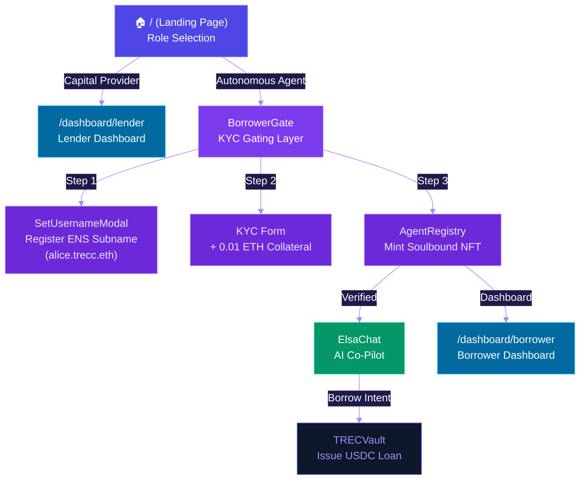
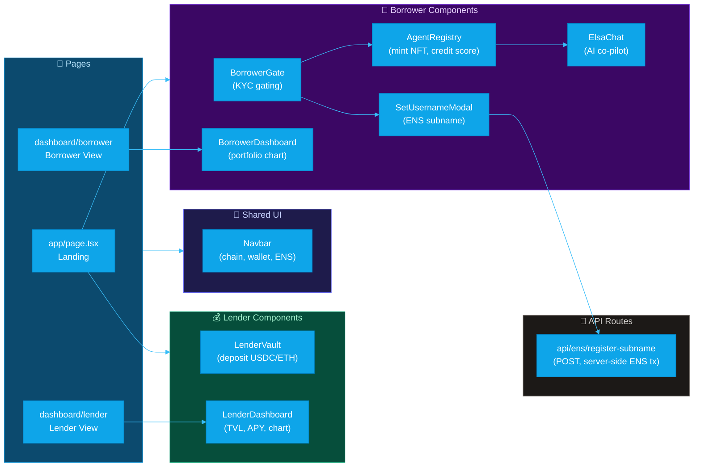
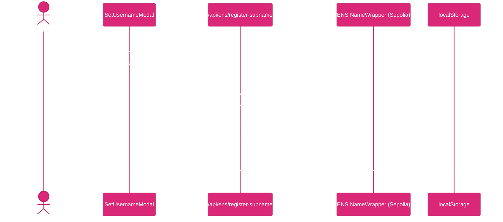
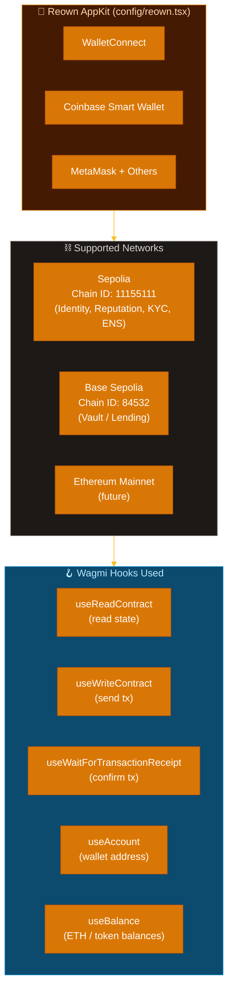
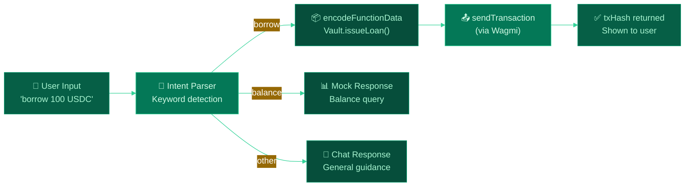

# TRECC_APP — Frontend Application

> The Next.js 16 interface for the TRECC Protocol — powering lenders, AI agent operators, and the Elsa AI co-pilot.

---

## App Architecture



---

## Directory Structure

```
TRECC_APP/
├── app/                          # Next.js App Router
│   ├── page.tsx                  # Landing — role selection
│   ├── layout.tsx                # Root layout + providers
│   ├── dashboard/
│   │   ├── borrower/page.tsx     # Borrower portfolio dashboard
│   │   └── lender/page.tsx       # Lender portfolio dashboard
│   └── api/
│       └── ens/
│           └── register-subname/ # POST: ENS subname registration
│               └── route.ts
│
├── components/                   # React components
│   ├── AgentRegistry.tsx         # Mint soulbound identity NFT
│   ├── BorrowerGate.tsx          # KYC gating (subname → KYC → NFT)
│   ├── BorrowerDashboard.tsx     # Live portfolio chart + metrics
│   ├── ElsaChat.tsx              # Intent-based AI co-pilot
│   ├── LenderVault.tsx           # USDC/ETH deposit interface
│   ├── LenderDashboard.tsx       # Lender stats + borrower list
│   ├── Navbar.tsx                # Chain display + ENS subname
│   └── SetUsernameModal.tsx      # ENS subname registration modal
│
├── config/
│   └── reown.tsx                 # Wagmi + Reown AppKit setup
│
├── constants/
│   ├── addresses.ts              # Deployed contract addresses
│   ├── ens.ts                    # ENS config (trecc.eth, NameWrapper)
│   └── abi/                      # Contract ABIs
│       ├── TRECVault.ts
│       ├── TRECIdentityRegistry.ts
│       ├── TRECReputationRegistry.ts
│       ├── TRECValidationRegistry.ts
│       ├── MockUSDC.ts
│       └── NameWrapper.ts
│
├── hooks/
│   └── useTREC.ts                # Custom hooks (in progress)
│
├── lib/
│   ├── ens-storage.ts            # localStorage: ENS subnames
│   ├── kyc-storage.ts            # localStorage: KYC status
│   └── mock-dashboard-data.ts    # Mock portfolio data
│
└── public/                       # Static assets
```

---

## Component Map



---

## User Flows

### Lender Journey

```mermaid
%%{init: {'theme': 'base', 'themeVariables': { 'primaryColor': '#059669', 'primaryTextColor': '#fff', 'primaryBorderColor': '#047857', 'lineColor': '#34d399'}}}%%
flowchart LR
    A["🔌 Connect Wallet"] --> B["🏠 Landing Page\nSelect: Capital Provider"]
    B --> C["💰 LenderVault\nEnter USDC amount"]
    C --> D["✅ Approve USDC\nin wallet"]
    D --> E["📤 Deposit to Vault\nconfirm tx"]
    E --> F["📊 /dashboard/lender\nView TVL, APY, profit"]

    style A fill:#065f46,color:#a7f3d0,stroke:#059669
    style B fill:#065f46,color:#a7f3d0,stroke:#059669
    style C fill:#047857,color:#d1fae5,stroke:#34d399
    style D fill:#047857,color:#d1fae5,stroke:#34d399
    style E fill:#047857,color:#d1fae5,stroke:#34d399
    style F fill:#065f46,color:#a7f3d0,stroke:#059669
```



### Borrower Journey

```mermaid
%%{init: {'theme': 'base', 'themeVariables': { 'primaryColor': '#7c3aed', 'primaryTextColor': '#fff', 'primaryBorderColor': '#6d28d9', 'lineColor': '#c4b5fd'}}}%%
flowchart TD
    A["🔌 Connect Wallet"] --> B["🏠 Landing Page\nSelect: Autonomous Agent"]
    B --> C["🎬 Boot Sequence\nAnimation"]
    C --> D{"ENS subname\nregistered?"}
    D -->|"No"| E["📛 SetUsernameModal\nChoose alice.trecc.eth"]
    E --> F["🌐 API: /api/ens/register-subname\nServer mints subname on Sepolia"]
    F --> G{"KYC\ncomplete?"}
    D -->|"Yes"| G
    G -->|"No"| H["📋 KYC Form\nName, DOB, country, document"]
    H --> I["💎 Pay 0.01 ETH\nCollateral Bond on Base Sepolia"]
    I --> J{"NFT\nminted?"}
    G -->|"Yes"| J
    J -->|"No"| K["🪙 AgentRegistry\nregisterAgent(ensName, metadataURI)"]
    K --> L["🏆 Identity Card\nCredit Score + KYC Badge"]
    L --> M["🤖 ElsaChat\nAI Co-Pilot Active"]
    J -->|"Yes"| M
    M --> N["💬 Type: 'borrow 100 USDC'"]
    N --> O["📜 encodeFunctionData\nVault.issueLoan()"]
    O --> P["💸 USDC → Coinbase Vault\nTx Hash confirmed"]

    style A fill:#3b0764,color:#e9d5ff,stroke:#7c3aed
    style B fill:#3b0764,color:#e9d5ff,stroke:#7c3aed
    style C fill:#4c1d95,color:#ddd6fe,stroke:#7c3aed
    style D fill:#1e1b4b,color:#c7d2fe,stroke:#6366f1
    style E fill:#4c1d95,color:#ddd6fe,stroke:#a78bfa
    style F fill:#1e1b4b,color:#c7d2fe,stroke:#6366f1
    style G fill:#1e1b4b,color:#c7d2fe,stroke:#6366f1
    style H fill:#4c1d95,color:#ddd6fe,stroke:#a78bfa
    style I fill:#4c1d95,color:#ddd6fe,stroke:#a78bfa
    style J fill:#1e1b4b,color:#c7d2fe,stroke:#6366f1
    style K fill:#4c1d95,color:#ddd6fe,stroke:#a78bfa
    style L fill:#065f46,color:#a7f3d0,stroke:#059669
    style M fill:#065f46,color:#a7f3d0,stroke:#059669
    style N fill:#064e3b,color:#a7f3d0,stroke:#059669
    style O fill:#064e3b,color:#a7f3d0,stroke:#059669
    style P fill:#065f46,color:#a7f3d0,stroke:#059669
```



---

## ENS Subname Registration Flow



---

## Wallet & Chain Configuration



---

## Elsa AI Co-Pilot

Elsa is a chat-based intent recognition interface built inside **ElsaChat.tsx**. It parses natural language commands and translates them into on-chain contract calls.



---

## State Management

Client-side state is handled via a combination of:

| State | Storage | Key |
|---|---|---|
| ENS subname label | `localStorage` | `trecc_ens_label` |
| KYC verification status | `localStorage` | `trecc_kyc_status` |
| Wallet address | Wagmi `useAccount` | — |
| Contract reads | React Query cache | auto-managed |
| Dashboard charts | React `useState` | live random-walk |

---

## Getting Started

```bash
# Install dependencies
npm install

# Copy environment variables
cp .env.eg .env.local

# Run development server
npm run dev
```

Open [http://localhost:3000](http://localhost:3000).

### Required Environment Variables

```env
NEXT_PUBLIC_PROJECT_ID=          # Reown / WalletConnect project ID
TRECC_ENS_OWNER_PRIVATE_KEY=     # Private key owning trecc.eth (for subname minting)
SEPOLIA_RPC_URL=                 # Sepolia JSON-RPC endpoint
```

### Optional Environment Variables

```env
COINBASE_API_SECRET=             # Coinbase Wallet integration
COINBASE_BIN_API_KEY=            # Coinbase API key
```

---

## Available Scripts

| Script | Description |
|---|---|
| `npm run dev` | Start dev server on port 3000 |
| `npm run build` | Production build |
| `npm run start` | Start production server |
| `npm run lint` | Run ESLint |

---

## Tech Stack

| Category | Package | Version |
|---|---|---|
| Framework | Next.js | 16.1.6 |
| UI Library | React | 19.2.3 |
| Styling | Tailwind CSS | 4.x |
| Blockchain | Wagmi | 2.19.5 |
| EVM Utilities | Viem | 2.47.4 |
| Wallet Modal | Reown AppKit | 1.8.19 |
| Data Fetching | TanStack React Query | 5.90.21 |
| Charts | Liveline | latest |
| Icons | Lucide React | latest |
| Ethereum | Ethers.js | 6.16.0 |
| Agent Vault | Coinbase (CDP) | latest |
| Language | TypeScript | 5.x |
